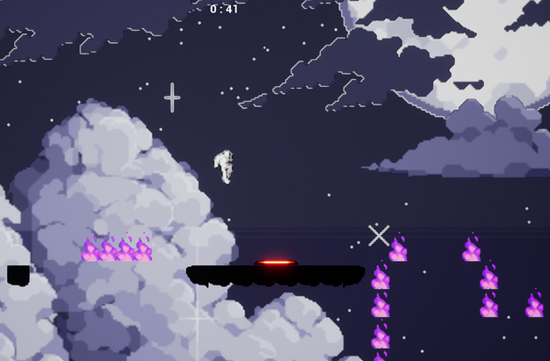
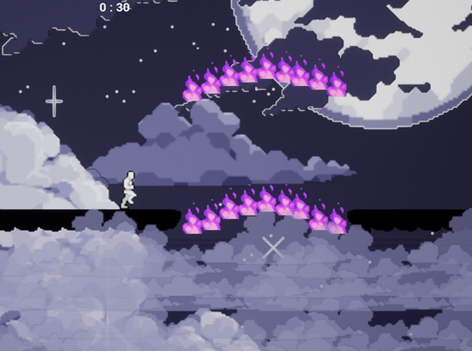

### 🎮 2D Platformer

**Description:**  
A precision 2D platformer developed in C++ visual scripting using Unreal Engine for a 72-hour game jam. The game challenges players with tight controls, creative level design, and unique movement mechanics inspired by classic arcade titles.

**Highlights:**  
- **Community Vote:** Game ranked #231 out of 1,200 entries for fun by popular vote. 
- **Unreal Engine:** Learned C++ visual scripting in one week for the game jam.  

**Screenshot:**  

**How to Play:**

- Visit my game's page on [itch.io](https://mervaz.itch.io/snooze)
- Follow instructions on the page to download and play the game (Windows)
