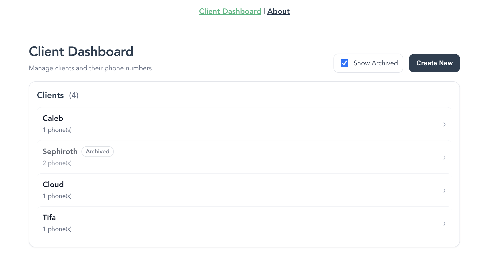
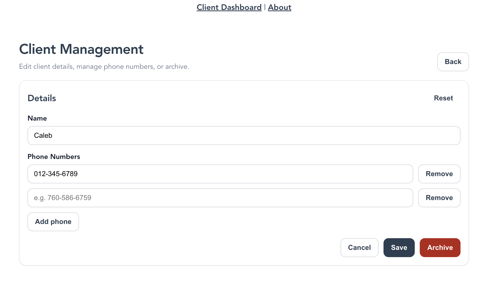

# 📊 Client Dashboard — Full Stack Application

## Overview

This project is a full stack client management application developed as part of a technical assessment focused on demonstrating practical engineering skills across database design, API development, and frontend user experience.

The application enables users to create, manage, update, and archive client records while supporting multiple phone numbers per client. The system is fully containerized using Docker to provide a reproducible development environment and mirrors a real-world production-style workflow involving a modern frontend, REST API backend, and relational database.

All acceptance criteria for the assessment have been fully implemented, with additional emphasis placed on clean architecture, maintainability, and user experience.





## Technology Stack

### Frontend

- Vue.js (Vue CLI)
- JavaScript (ES6+)
- Fetch API for HTTP communication
- Hot-reloading development environment

### Backend

- .NET Core Web API
- RESTful API architecture
- Swagger API documentation
- Entity Framework Core

### Database

- Relational SQL database
- Containerized initialization and persistence via Docker volumes
- DevOps / Environment
- Docker & Docker Compose
- Multi-container orchestration
- Isolated development environment

## Project Goals

The goal of this application is to provide a centralized dashboard for managing client information while demonstrating:

- Full stack system design
- REST API implementation
- Relational data modeling
- Frontend state and form management
- Docker-based development workflows

## Application Features

### Client Dashboard

- Displays all active (non-archived) clients
- “Create New Client” workflow
- Clickable client entries for editing
- Real-time updates via API integration

### Client Management Page

- Edit client details
- Add, modify, and remove multiple phone numbers
- Persist updates to backend database
- Archive client records without deletion (soft delete)

## Database Design

The data model supports relational client management:

### Tables

- Clients
    - Stores client identity and metadata
    - Includes archive status for soft deletion
- PhoneNumbers
    - Stores multiple phone numbers per client
    - Maintains one-to-many relationship with Clients

### Relationships

- One Client → Many Phone Numbers

This structure enables flexible client records while preserving historical data.

## API Endpoints

The backend exposes a RESTful API supporting full CRUD-style operations:

| Endpoint                         | Description                    |
|----------------------------------|--------------------------------|
| `GET /api/Clients/{id}`          | Retrieve a single client       |
| `GET /api/Clients`               | Retrieve all clients           |
| `POST /api/Clients`              | Create a new client            |
| `PUT /api/Clients/{id}`          | Update client information      |
| `POST /api/Clients/{id}/archive` | Archive (soft delete) a client |

Swagger documentation is available for interactive API testing.

## 🐳 Running the Project

The application is fully containerized.

### Requirements

- Docker
- Docker Compose

### Start the Application

```bash 
docker-compose -f docker-compose.yml up
```

This command:

- Builds frontend and backend containers
- Initializes the database
- Starts all services

### Access Points

| Service           | URL                             |
|-------------------|----------------------------------|
| Frontend UI       | http://localhost:8080           |
| Backend API       | http://localhost:5000           |
| Swagger API Docs  | http://localhost:5001/swagger   |

## Development Workflow

### Frontend

- Hot reload enabled
- Changes appear immediately without rebuilding containers

### Backend

After backend changes:

```bash
docker-compose build
docker-compose up
```

Reset Database (Optional)
```bash
docker-compose down
docker rm -f $(docker ps -a -q)
docker volume rm $(docker volume ls -q)
docker-compose up
```

## Design Considerations

- Soft deletion preserves historical records while maintaining UI clarity.
- Centralized API layer abstracts networking logic from UI components.
- Containerization ensures consistent onboarding and execution environments.
- Separation of concerns between UI, API, and persistence layers improves maintainability.

## Acceptance Criteria Completion

All required assessment objectives were implemented:

### Database

- Client table created
- Phone number table created
- One-to-many relationship implemented

### API

- GetClient
- GetAllClients
- CreateClient
- UpdateClient
- ArchiveClient

### UI

- Client Dashboard view
- Client creation workflow
- Editable client management page
- Multi-phone-number support
- Archive functionality

### Additional Enhancements

Beyond the base requirements, the project emphasizes:

- Clean API abstraction layer for frontend requests
- Consistent error handling and response normalization
- Modular frontend architecture
- Improved developer ergonomics through Docker workflows

## What This Project Demonstrates

This project highlights my ability to:

- Build and integrate full stack applications
- Design relational data models
- Implement RESTful APIs
- Work within containerized environments
- Deliver production-style features from specification to completion