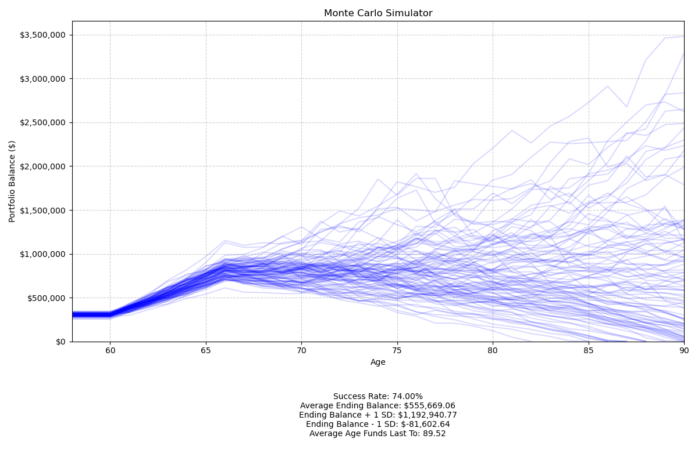
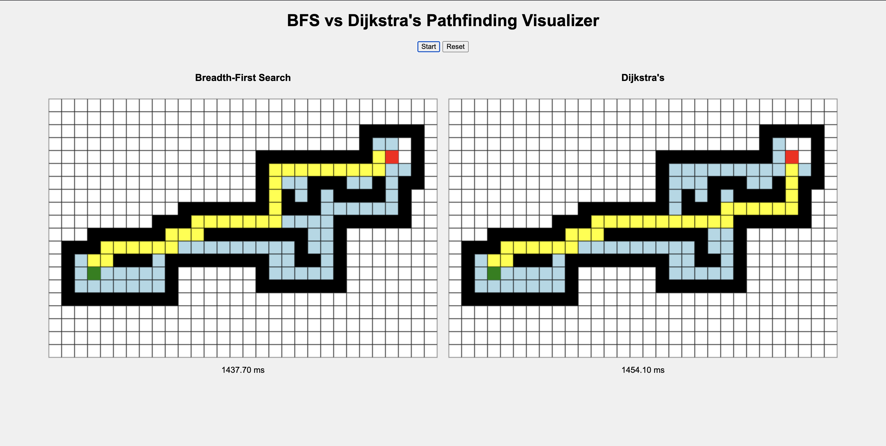

# 🧑‍💻 Caleb Mercier - Software Engineering Portfolio

Welcome to my portfolio! This repository contains a collection of software engineering projects I’ve built to showcase my skills in design, development, and problem solving. Each project has its own subdirectory with source code, documentation, and setup instructions.  

---

## 📂 Projects

### [💸 Monte Carlo Retirement Simulator](./Retirement_Simulator)

**Description:**  
This project is a Monte Carlo retirement portfolio simulator that models the long-term growth and depletion of individual or joint investment portfolios under varying market conditions. It provides probabilistic projections of portfolio balances, accounting for income, expenses, savings, inflation, and stochastic market returns, helping users make informed financial planning decisions. Built with Python, it leverages numpy for numerical computations and matplotlib for interactive visualizations.

**Highlights:**  
- **Stochastic Monte Carlo Simulation:** Runs thousands of scenarios to assess portfolio longevity and risk under realistic market volatility.  
- **Customizable Financial Inputs:** Supports multiple individuals, joint accounts, pre- and post-retirement expenses, and user-defined investment allocations.  
- **Interactive Visualization & Reporting:** Generates clear, professional plots of portfolio trajectories, with success rates, ending balances, and key statistical summaries to aid decision-making.  

---

### [➡️ BFS vs Dijkstra Pathfinding Visualizer](./BFSvsDijkstras)
**Description:**  
This project is an interactive web-based visualizer that demonstrates and compares two popular pathfinding algorithms: Breadth-First Search (BFS) and Dijkstra’s Algorithm.
It allows users to create mazes by placing walls, adjust start and end points, and then watch the algorithms explore the grid in real-time. The main goal is to provide an educational and visual tool to understand how different algorithms search for the shortest path in a grid environment.

**Highlights:**  
- **Interactive Grid Editing:** Place and erase walls by clicking and dragging. Move start (green) and end (red) positions dynamically.
- **Real-Time Visualization:** BFS and Dijkstra run side by side on separate grids. Animations show visited cells (light blue) and final path (yellow). Execution time displayed in milliseconds for each algorithm.  

---

### [🎮 2D Platformer](./2D_Platformer)

**Description:**  
A precision 2D platformer developed in C++ visual scripting using Unreal Engine for a 72-hour game jam. The game challenges players with tight controls, creative level design, and unique movement mechanics inspired by classic arcade titles.

**Highlights:**  
- **Community Vote:** Game ranked #231 out of 1,200 entries for fun by popular vote. 
- **Unreal Engine:** Learned C++ visual scripting in one week for the game jam.  

**Screenshot:**  

---

## 🚀 How to Explore
1. Browse the project list above.  
2. Click the project name to view its source code and documentation in its subdirectory.  
3. Each project folder contains setup/run instructions.  

---

## 🛠️ Tech Stack
This portfolio includes projects written with:  
- **Languages:** C, C++, Python, JavaScript, HTML  
- **Frameworks & Libraries:** NumPy, Matplotlib, CSS3, Unreal Engine, etc. 
- **Tools:** Git 

---

## 📬 Contact
If you’d like to connect, discuss projects, or collaborate:  
- 📧 Email: calebmercier@gmail.com  
- 💼 LinkedIn: [Caleb Mercier](https://www.linkedin.com/in/calebmercier)  
- 🌐 Portfolio Website: [calebmercier.com](https://calebmercier.com)  
