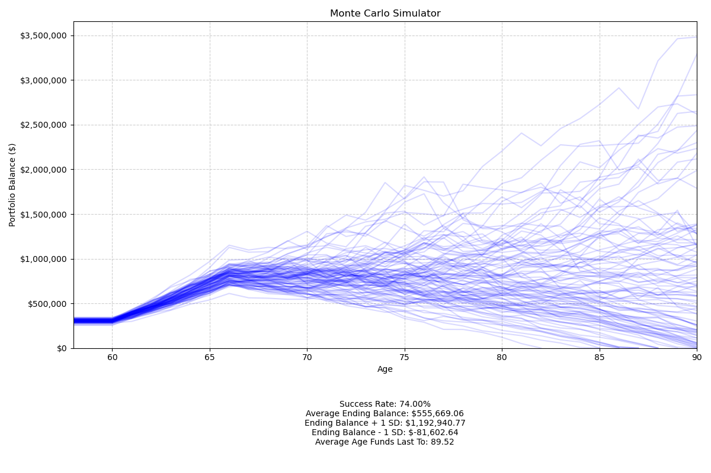
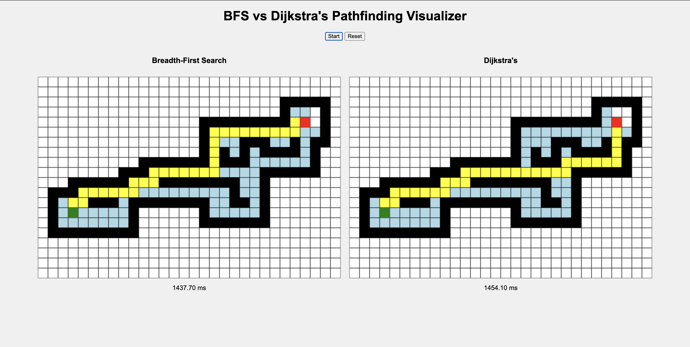
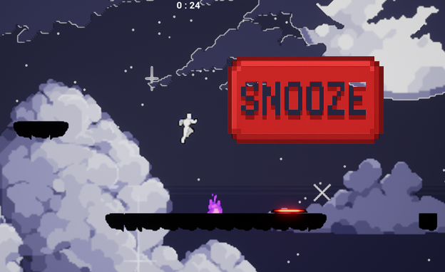

# 🧑‍💻 Caleb Mercier - Software Engineering Portfolio

Welcome to my portfolio! This repository contains a collection of software engineering projects I’ve built to showcase my skills in design, development, and problem solving. Each project has its own subdirectory with source code, documentation, and setup instructions.  

---

## 📂 Projects

### [🤖 Finza: AI-Powered Robo Advisor](https://github.com/smiski/Finza)

**Description:**

This project is a full-stack financial planning application that leverages machine learning and simulation to generate personalized retirement recommendations. The system integrates a cross-platform frontend, a secure backend API, and a Monte Carlo simulation engine to model long-term financial outcomes under uncertainty.

Built using Kotlin Multiplatform, FastAPI, and PostgreSQL, the application combines modern backend architecture with AI-driven insights to deliver actionable financial guidance.

**Highlights:**
- **Full Stack Architecture:** Developed a cross-platform application using Kotlin Multiplatform with a FastAPI backend and PostgreSQL database.
- **AI-Driven Recommendations:** Integrated a PyTorch-trained model to generate personalized financial insights and recommendations.
- **Monte Carlo Simulation Engine:** Runs thousands of simulations to model portfolio performance under stochastic market conditions.
- **Secure Backend Design:** Implemented RESTful APIs with data validation and secure persistence.
- **Scalable System Design:** Structured backend and simulation components for modularity and future extensibility.

---

### [✈️ Real-Time Battlespace Simulation System](./WSCE_Mini_Battlespace)

**Description:**

This C++ project implements a real-time battlespace modeling and simulation environment inspired by modern defense training and evaluation systems. The simulator models aircraft and missile interactions using physics-based kinematics, parallel processing, and networked telemetry.

A fixed-timestep simulation loop updates entities in real time while broadcasting live state data over UDP, allowing external visualization and control tools to interact with the simulation.

This project demonstrates core software engineering concepts used in synthetic training environments, flight simulators, and large-scale Modeling & Simulation (M&S) systems.

**Highlights:**
- **Real-Time Modeling & Simulation**
  - Fixed timestep deterministic simulation loop
  - Real-time pacing suitable for training environments

- **Parallel Processing & Threading**
  - Custom C++ thread pool
  - Parallel entity updates per simulation tick
  - Scalable architecture for large simulations

- **Physics & Mathematical Modeling**
  - 3D kinematics
  - Euler and RK4 numerical integration
  - Proportional Navigation (PN) missile guidance

- **Network-Connected Software**
  - Cross-platform UDP telemetry streaming
  - UDP command/control interface
  - External tool interoperability

- **Live Visualization**
  - Python real-time visualization client
  - Live aircraft and missile tracking

---

### [📊 Client Dashboard — Full Stack Application](./Client_Dashboard)

**Description:**

This project is a full stack client management application designed to create, update, and organize client records through a modern web interface backed by a RESTful API and relational database. The system supports multi-phone-number management, soft deletion (archiving), and containerized deployment, demonstrating end-to-end development across frontend, backend, and database layers. Built with Vue.js, .NET Core, and Docker, the application emphasizes clean architecture, API integration, and real-world development workflows.

**Highlights:**
- **Full Stack Architecture:** Designed and implemented a complete system using Vue.js for the frontend, a .NET Core REST API backend, and a relational SQL database, fully orchestrated with Docker containers.
- **Relational Data Modeling:** Implemented a one-to-many client-to-phone-number schema with soft-delete archiving to preserve historical data while maintaining a clean user experience.
- **RESTful API Integration:** Built and consumed endpoints for creating, retrieving, updating, and archiving clients, with centralized request handling and consistent error management.
- **Dynamic Client Management UI:** Developed interactive dashboard and management views allowing real-time editing, multi-phone-number support, and seamless navigation between workflows.
- **Containerized Development Environment:** Leveraged Docker and Docker Compose to provide reproducible builds, simplified onboarding, and consistent local development across services.

---

### [💸 Monte Carlo Retirement Simulator](./Retirement_Simulator)

**Description:**  
This project is a Monte Carlo retirement portfolio simulator that models the long-term growth and depletion of individual or joint investment portfolios under varying market conditions. It provides probabilistic projections of portfolio balances, accounting for income, expenses, savings, inflation, and stochastic market returns, helping users make informed financial planning decisions. Built with Python, it leverages numpy for numerical computations and matplotlib for interactive visualizations.

**Highlights:**  
- **Stochastic Monte Carlo Simulation:** Runs thousands of scenarios to assess portfolio longevity and risk under realistic market volatility.  
- **Customizable Financial Inputs:** Supports multiple individuals, joint accounts, pre- and post-retirement expenses, and user-defined investment allocations.  
- **Interactive Visualization & Reporting:** Generates clear, professional plots of portfolio trajectories, with success rates, ending balances, and key statistical summaries to aid decision-making.  

---

### [➡️ BFS vs Dijkstra Pathfinding Visualizer](./BFSvsDijkstras)
**Description:**  
This project is an interactive web-based visualizer that demonstrates and compares two popular pathfinding algorithms: Breadth-First Search (BFS) and Dijkstra’s Algorithm.
It allows users to create mazes by placing walls, adjust start and end points, and then watch the algorithms explore the grid in real-time. The main goal is to provide an educational and visual tool to understand how different algorithms search for the shortest path in a grid environment.

**Highlights:**  
- **Interactive Grid Editing:** Place and erase walls by clicking and dragging. Move start (green) and end (red) positions dynamically.
- **Real-Time Visualization:** BFS and Dijkstra run side by side on separate grids. Animations show visited cells (light blue) and final path (yellow). Execution time displayed in milliseconds for each algorithm.  

---

### [🎮 2D Platformer](./2D_Platformer)

**Description:**  
A precision 2D platformer developed in C++ visual scripting using Unreal Engine for a 72-hour game jam. The game challenges players with tight controls, creative level design, and unique movement mechanics inspired by classic arcade titles.

**Highlights:**  
- **Community Vote:** Game ranked #231 out of 1,200 entries for fun by popular vote. 
- **Unreal Engine:** Learned C++ visual scripting in one week for the game jam.  

**Screenshot:**  

---

## 🚀 How to Explore
1. Browse the project list above.  
2. Click the project name to view its source code and documentation in its subdirectory.  
3. Each project folder contains setup/run instructions.  

---

## 🛠️ Tech Stack
This portfolio includes projects written with:  
- **Languages:** C, C++, Python, JavaScript, HTML  
- **Frameworks & Libraries:** NumPy, Matplotlib, CSS3, Unreal Engine, etc. 
- **Tools:** Git 

---

## 📬 Contact
If you’d like to connect, discuss projects, or collaborate:  
- 📧 Email: calebmercier@gmail.com  
- 💼 LinkedIn: [Caleb Mercier](https://www.linkedin.com/in/calebmercier)  
- 🌐 Portfolio Website: [calebmercier.com](https://calebmercier.com)  
