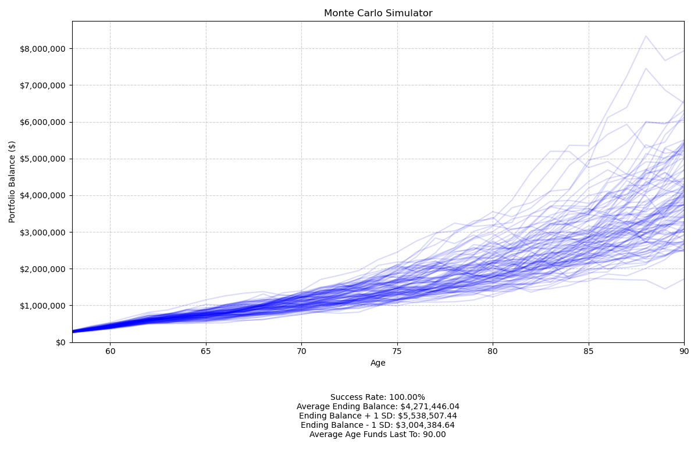

# 💸 Monte Carlo Retirement Simulator

**Description:**  
This Python project simulates retirement portfolio outcomes using Monte Carlo methods. It models the growth and depletion of individual or joint investment portfolios under stochastic market conditions, accounting for income, expenses, annual savings, inflation, and investment returns. The simulator generates probabilistic projections to help users plan and evaluate retirement readiness.  

**Highlights:**  
- **Stochastic Monte Carlo Simulation:** Run thousands of scenarios to assess portfolio longevity and risk under realistic market volatility.  
- **Customizable Inputs:** Supports multiple individuals, joint accounts, pre- and post-retirement expenses, and detailed investment allocations.  
- **Interactive Visualization & Reporting:** Generates plots of portfolio trajectories by age and provides success rates, ending balances, and other key statistics.




---

## Getting Started

### Requirements
- Python 3.8+  
- Packages: `numpy`, `matplotlib`  

Install the required packages using pip:  
```
pip install numpy matplotlib
```

### Running the Simulator

1.	Place the JSON input file in the same directory as the scripts. Example files provided:
- **married_retirement_input.json** – for joint individuals
- **single_retirement_input.json** – for a single individual

2.	Run the simulation and visualize results:
```
python visualization.py
```

3.	View the outputs:
- Interactive plot showing portfolio balances by age for all simulations
- Text summary including:
	- Success Rate (% of simulations ending with positive funds)
  	- Average Ending Balance
	- Ending Balance ± 1 Standard Deviation
  	- Average Age Funds Last

### Editing the JSON Inputs

You can customize scenarios by modifying the input JSON file:

```
{
  "individuals": [
    {
      "name": "Bill",
      "current_age": 60,
      "retirement_age": 67,
      "planning_horizon": 90,
      "pre_retirement_income": 80000,
      "post_retirement_income": 30000,
      "portfolio": {
        "cash": 5000,
        "taxable": 40000,
        "tax_deferred": 100000,
        "tax_free": 10000
      },
      "annual_savings": {
        "cash": 0,
        "taxable": 2000,
        "tax_deferred": 10000,
        "tax_free": 0
      }
    },
    {
      "name": "Sarah",
      "current_age": 58,
      "retirement_age": 65,
      "planning_horizon": 90,
      "pre_retirement_income": 60000,
      "post_retirement_income": 20000,
      "portfolio": {
        "cash": 500,
        "taxable": 0,
        "tax_deferred": 60000,
        "tax_free": 6000
      },
      "annual_savings": {
        "cash": 0,
        "taxable": 0,
        "tax_deferred": 5000,
        "tax_free": 500
      }
    },
    {
      "name": "Joint",
      "portfolio": {
        "cash": 10000,
        "taxable": 0,
        "tax_deferred": 0,
        "tax_free": 0
      },
      "annual_savings": {
        "cash": 1000,
        "taxable": 0,
        "tax_deferred": 0,
        "tax_free": 0
      }
    }
  ],
  "pre_retirement_expenses": 100000,
  "post_retirement_expenses": 100000,
  "returns": {
    "cash": {"mean": 0.01, "volatility": 0.005},
    "taxable": {"mean": 0.04, "volatility": 0.05},
    "tax_deferred": {"mean": 0.06, "volatility": 0.1},
    "tax_free": {"mean": 0.08, "volatility": 0.14}
  },
  "inflation": 0.025,
  "num_simulations": 10000
}
```

**Individual Information**
- **"name":** Individual’s name or "Joint" for shared accounts
- **"current_age":** Current age in years
- **"retirement_age":** Age at retirement
- **"planning_horizon":** Age to simulate until (life expectancy)
- **"pre_retirement_income":** Annual income before retirement (salary, bonuses, etc.)
- **"post_retirement_income":** Annual income after retirement (Social Security, pensions, annuities, etc.)
- **"portfolio":** Current balances in each bucket
	- cash, taxable, tax_deferred, tax_free
- **"annual_savings":** Contributions per year to each bucket

**Expenses**
- **"pre_retirement_expenses":** Expected annual expenses before retirement
- **"post_retirement_expenses":** Expected annual expenses after retirement

**Market Returns**
- **"returns":** Expected market returns and volatility for each bucket
	- **mean –** Expected average annual return (decimal, e.g., 0.06 = 6%)
	- **volatility –** Standard deviation of annual returns (decimal)

**Inflation and Simulations**
- **"inflation":** Annual inflation rate (decimal)
- **"num_simulations":** Number of Monte Carlo simulations to run

### Tips ###
- To simulate a joint portfolio, include an individual with "name": "Joint" and specify the shared portfolio and savings.
- Modify "returns" and "inflation" to test different market conditions.
- Increase "num_simulations" for more robust statistics (slower) or decrease for faster results (less precise).
