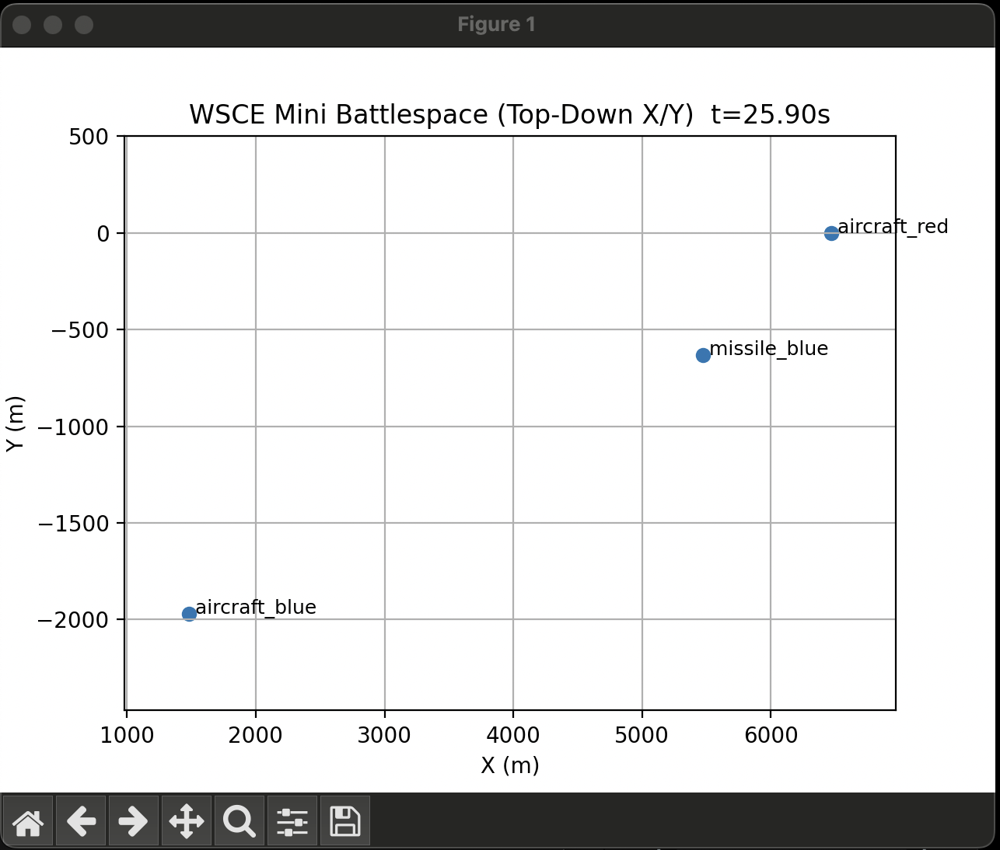
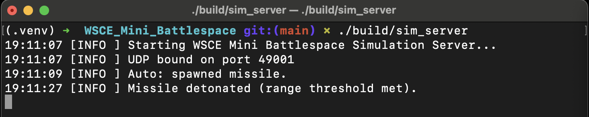

# ✈️ WSCE Mini Battlespace Simulation

## Description
This C++ project implements a real-time battlespace modeling and simulation environment inspired by modern defense training and evaluation systems. The simulator models aircraft and missile interactions using physics-based kinematics, parallel processing, and networked telemetry.

A fixed-timestep simulation loop updates entities in real time while broadcasting live state data over UDP, allowing external visualization and control tools to interact with the simulation.

This project demonstrates core software engineering concepts used in synthetic training environments, flight simulators, and large-scale Modeling & Simulation (M&S) systems.

---

## Highlights

- **Real-Time Modeling & Simulation**
  - Fixed timestep deterministic simulation loop
  - Real-time pacing suitable for training environments

- **Parallel Processing & Threading**
  - Custom C++ thread pool
  - Parallel entity updates per simulation tick
  - Scalable architecture for large simulations

- **Physics & Mathematical Modeling**
  - 3D kinematics
  - Euler and RK4 numerical integration
  - Proportional Navigation (PN) missile guidance

- **Network-Connected Software**
  - Cross-platform UDP telemetry streaming
  - UDP command/control interface
  - External tool interoperability

- **Live Visualization**
  - Python real-time visualization client
  - Live aircraft and missile tracking





---

## Getting Started

### Requirements

#### C++ Build Requirements
- CMake **3.16+**
- C++17 compatible compiler
  - macOS: AppleClang (Xcode Command Line Tools)
  - Linux: GCC or Clang
  - Windows: MSVC or Clang

#### Python Visualization Requirements
- Python **3.8+**
- Python packages:
  - `matplotlib`

---

### Install Python Dependencies

```bash
python3 -m venv .venv
source .venv/bin/activate
pip install matplotlib
```

### Building the Project

From the repository root:

```bash
rm -rf build
cmake -S . -B build -DCMAKE_BUILD_TYPE=Release
cmake --build build -j
```

After building, the following executables are created:

```bash
build/sim_server
build/sim_client
```

### Running the Project

The system follows a common simultion architecture:

```bash
Simulation Server → UDP Telemetry → Visualization Client
```

#### Step 1 - Start the Simulation Server

```bash
./build/sim_server
```

Expected console output:

```bash
[INFO ] Starting WSCE Mini Battlespace Simulation Server...
[INFO ] UDP bound on port 49001
[INFO ] Auto: spawned missile.
```

The server performs:
- Real-time physics simulation
- Parallel entity updates
- Missile guidance calculations
- Telemetry broadcasting over UDP

#### Step 2 - Run the Python Visualization (Recommended)

Open a second terminal:

```bash
source .venv/bin/activate
python tools/visualize_udp.py
```

A visualization will appear showing a top-down battlespace view.

Visualization features:
- Live aircraft motion
- Missile intercept trajectories
- Continuous real-time updates (~50 Hz)
- Automatic camera scaling

#### Optional Step - Run the Text Telemetry Client

Instead of visualization, you may inspect raw telemetry output:

```bash
./build/sim_client
```

This prints live JSON telemetry streamed from the simulation.

⚠️ Only one telemetry receiver can bind to the port at a time unless socket reuse is enabled.

---

## Interactive Simulation Commands

The simulation accepts UDP command messages while running.
Open another terminal and send commands:

#### Spawn a Missile

```bash
echo "spawn_missile" | nc -u 127.0.0.1 49001
```

#### Change Aircraft Velocity

```bash
echo "set_target_vel 300 50 0" | nc -u 127.0.0.1 49001
```

#### Reset Scenario

```bash
echo "reset" | nc -u 127.0.0.1 49001
```

Commands immediately affect the running situation

---

## Running Tests

Unit tests validate math operations and simulation behavior.

```bash
ctest --test-dir build --output-on-failure
```

Expected output:

```bash
100% tests passed
```

---

## Architecture Overview

### Simulation Core

- Entity-based world model
- Aircraft and missile platform classes
- Fixed timestep scheduler (50 Hz)
- Parallel execution via thread pool

### Physics Modeling

- Point-mass kinematics
- RK4 and Euler integrators (Strategy Pattern)
- Proportional Navigation missile guidance

### Networking

- UDP telemetry publisher
- UDP command receiver
- Cross-platform socket abstraction (macOS/Linux/Windows)

### Visualization Pipeline

```bash
C++ Simulation
      ↓ UDP
Python Visualizer
      ↓
Real-Time Plot
```

---

## Project Structure

```bash
wsce_mini_battlespace/
├── include/wsce/
│   ├── sim/
│   ├── net/
│   ├── core/
│   ├── math/
│   └── util/
├── src/
│   ├── sim/
│   ├── net/
│   ├── core/
│   └── apps/
├── tools/
│   └── visualize_udp.py
├── tests/
├── CMakeLists.txt
└── README.md
```

---

## Technical Concepts Demonstrated

### Programming Experience

- Modern C++17
- Object-oriented architecture
- Strategy and RAII design patterns
- Modular system design

### Parallel Processing & Threading

- Custom thread pool implementation
- Work queue scheduling
- Synchronization barriers

### Physics & Mathematical Modeling

- Numerical integration methods
- Vector kinematics
- Guidance and control algorithms

### Networked Software Development

- UDP messaging systems
- Real-time telemetry streaming
- External visualization integration

### Modeling & Simulation

- Deterministic timestep simulation
- Real-time pacing
- Entity lifecycle management

---

## Tips

- Use the Python visualization for the best demonstration experience.
- Modify simulation parameters in:

```bash
include/wsce/config.hpp
```

- Increase runtime by adjusting kMaxSimSec.
- Additional entities (radars, drones, sensors) can be added easily using the entity interface.

---

## Project Purpose

This project was designed as a portfolio demonstration of skills relevant to:

- Battlespace Modeling & Simulation
- Synthetic training environments
- Flight simulator integration
- Real-time distributed systems
- Defense and aerospace software engineering